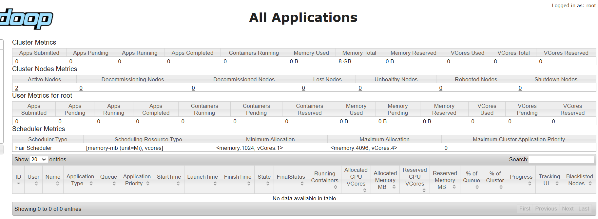
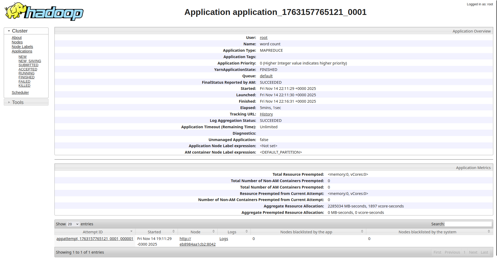
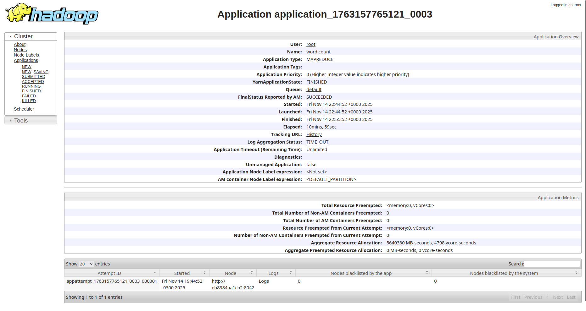
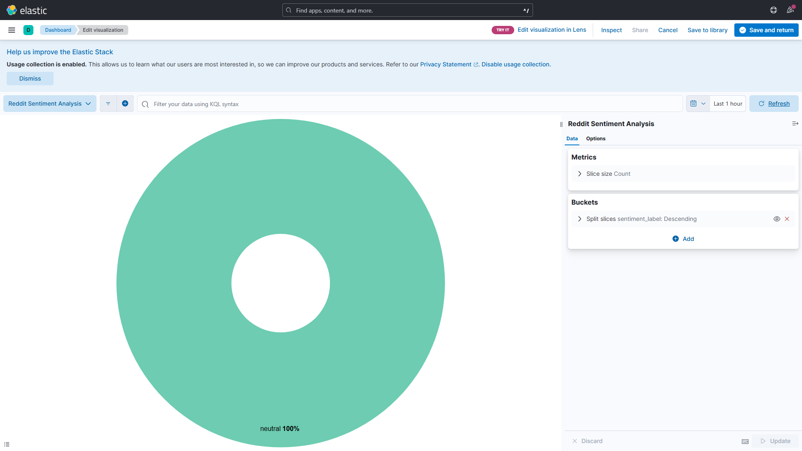
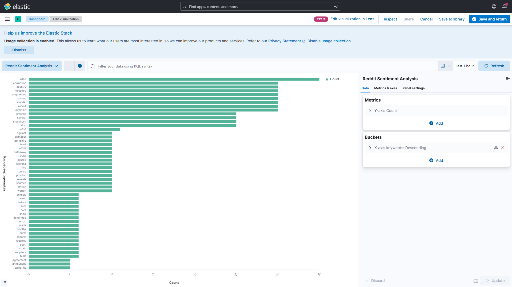
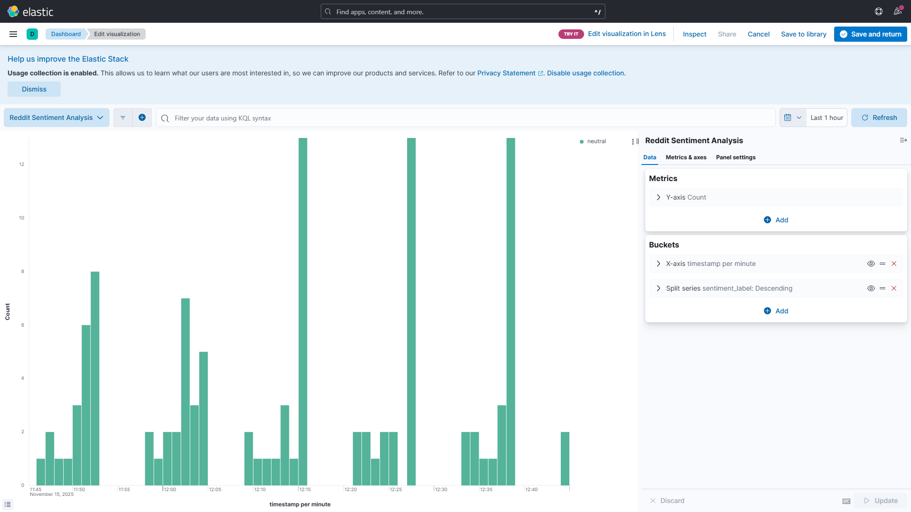
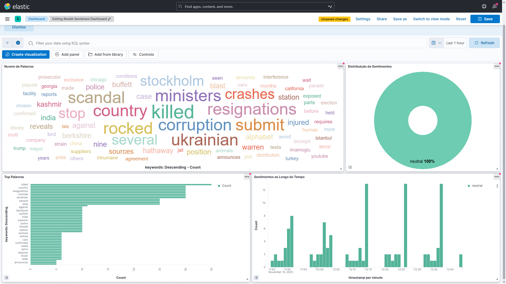

# Introdução

# Conhecendo o Apache Hadoop

## Montagem de um cluster Hadoop básico

Este repositório contém a implementação completa de um cluster Hadoop básico usando containers Docker, incluindo:

- 1 nó master (Namenode)
- 2 nós slaves (Datanodes)
- HDFS configurado e testado
- Interfaces Web funcionais (Namenode, ResourceManager)
- Exemplo WordCount

### Arquitetura do cluster

```
┌─────────────────────────────────────────────────┐
│              MASTER NODE (Namenode)             │
│  - Gerencia metadados do HDFS                   │
│  - Web UI: http://localhost:9870                │
│  - ResourceManager (YARN): http://localhost:8088│
└────────────────────────┬────────────────────────┘
                         │
                ┌────────┴────────┐
                │                 │
        ┌───────▼──────┐  ┌───────▼──────┐
        │ SLAVE NODE 1 │  │ SLAVE NODE 2 │
        │  (Datanode1) │  │  (Datanode2) │
        │ - DataNode   │  │ - DataNode   │
        │ - NodeMgr    │  │ - NodeMgr    │
        └──────────────┘  └──────────────┘
```

### Containers

**namenode:** Master node + ResourceManager
**datanode1 e datanode2:** Workers para HDFS
**nodemanager1 e nodemanager2:** Workers para YARN
**resourcemanager:** Gerenciador de recursos
**historyserver:** Histórico de jobs

## Estrutura de arquivos

```bash
hadoop-cluster/
├── docker-compose.yml                 # Definição dos serviços
├── hadoop.env                         # Configurações Hadoop
├── scripts/
│   ├── mapper.py                      # Mapper para WordCount
│   ├── reducer.py                     # Reducer para WordCount
│   └── WordCount.java                 # Versão Java
├── dados/
│   ├── teste.txt              # Arquivo de teste
```

## Configurações principais

### HDFS (Hadoop Distributed File System)

| Parâmetro               | Valor                  | Descrição           |
| ----------------------- | ---------------------- | ------------------- |
| `fs.defaultFS`          | `hdfs://namenode:9000` | URI do filesystem   |
| `dfs.replication`       | `2`                    | Fator de replicação |
| `dfs.namenode.name.dir` | `/hadoop/dfs/name`     | Dir do Namenode     |
| `dfs.datanode.data.dir` | `/hadoop/dfs/data`     | Dir dos Datanodes   |

### YARN (Resource Manager)

| Parâmetro                              | Valor             | Descrição            |
| -------------------------------------- | ----------------- | -------------------- |
| `yarn.resourcemanager.hostname`        | `resourcemanager` | Hostname do RM       |
| `yarn.nodemanager.resource.memory-mb`  | `4096`            | RAM por NodeManager  |
| `yarn.nodemanager.resource.cpu-vcores` | `4`               | CPUs por NodeManager |

### MapReduce

| Parâmetro                    | Valor  | Descrição             |
| ---------------------------- | ------ | --------------------- |
| `mapreduce.framework.name`   | `yarn` | Framework usado       |
| `mapreduce.map.memory.mb`    | `512`  | RAM para Map tasks    |
| `mapreduce.reduce.memory.mb` | `512`  | RAM para Reduce tasks |

## Interfaces Web

### 1. Namenode Web UI

- **URL**: http://localhost:9870
- **Funcionalidades**:
  - Status do HDFS
  - DataNodes ativos
  - Uso de espaço
  - Explorador de arquivos
  - Logs do sistema

**Como acessar**:

1. Abra o navegador
2. Acesse `http://localhost:9870`

### 2. ResourceManager Web UI

- **URL**: http://localhost:8088
- **Funcionalidades**:
  - Aplicações em execução
  - Filas de recursos
  - Jobs MapReduce
  - Uso de CPU/Memória
  - Histórico

**Como monitorar um job**:

1. Acesse `http://localhost:8088`
2. Clique em "Applications"
3. Clique no ApplicationID do job em execução
4. Veja progresso de Map e Reduce

## Execução

```bash
cd hadoop-cluster
docker compose up -d

#verificar estado dos containers
docker ps
```

### Executando Word Count (Python)

1. Instalar o python nos containers `nodemanager1`, `nodemanager2`, `datanode1`, `datanode2`

```bash
docker exec -it nodemanager1 bash -c "
echo 'deb http://archive.debian.org/debian/ stretch main' > /etc/apt/sources.list && \
echo 'deb http://archive.debian.org/debian-security/ stretch/updates main' >> /etc/apt/sources.list && \
apt-get update && \
apt-get install -y python3 && \
python3 --version
"
```

```bash
docker exec -it nodemanager2 bash -c "
echo 'deb http://archive.debian.org/debian/ stretch main' > /etc/apt/sources.list && \
echo 'deb http://archive.debian.org/debian-security/ stretch/updates main' >> /etc/apt/sources.list && \
apt-get update && \
apt-get install -y python3 && \
python3 --version
"
```

```bash
docker exec -it datanode1 bash -c "
echo 'deb http://archive.debian.org/debian/ stretch main' > /etc/apt/sources.list && \
echo 'deb http://archive.debian.org/debian-security/ stretch/updates main' >> /etc/apt/sources.list && \
apt-get update && \
apt-get install -y python3 && \
python3 --version
"
```

```bash
docker exec -it datanode2 bash -c "
echo 'deb http://archive.debian.org/debian/ stretch main' > /etc/apt/sources.list && \
echo 'deb http://archive.debian.org/debian-security/ stretch/updates main' >> /etc/apt/sources.list && \
apt-get update && \
apt-get install -y python3 && \
python3 --version
"
```

2. Tornar Scripts Executáveis

```bash
chmod +x scripts/*.py
```

3. Copiar Scripts para o Container

```bash
docker cp scripts/mapper.py namenode:/tmp/
docker cp scripts/reducer.py namenode:/tmp/
```

4. Copiar o arquivo de teste para o container

```bash
docker cp dados/teste.txt namenode:/tmp/
```

5. Criar Diretórios no HDFS

```bash
docker exec -it namenode hdfs dfs -mkdir -p /user/hadoop/input
docker exec -it namenode hdfs dfs -mkdir -p /user/hadoop/output

#Fazer o upload do arquivo de teste
docker exec -it namenode hdfs dfs -put /tmp/teste.txt /user/hadoop/input/
```

6. Executar WordCount com Hadoop Streaming

```bash
#Limpar o diretório de saída
docker exec -it namenode hdfs dfs -rm -r /user/hadoop/output 2>/dev/null || true

# Tornar scripts executáveis dentro do container
docker exec -it namenode chmod +x /tmp/mapper.py /tmp/reducer.py

docker exec -it namenode hadoop jar \
  /opt/hadoop-3.1.3/share/hadoop/tools/lib/hadoop-streaming-3.1.3.jar \
  -files /tmp/mapper.py,/tmp/reducer.py \
  -input /user/hadoop/input/teste.txt \
  -output /user/hadoop/output \
  -mapper mapper.py \
  -reducer reducer.py
```

7. Verificar resultados

```bash
docker exec -it namenode hdfs dfs -ls /user/hadoop/output/
docker exec -it namenode hdfs dfs -cat /user/hadoop/output/part-00000
```

- Saída esperada

```
Big	2
Data	2
Hadoop	3
MapReduce	2
O	3
framework	1
importante	1
poderoso	1
processa	1
usa	1
é	3
```

8. Encerrar os containers

```bash
docker compose down
```

### Executando Word Count (Java)

1. Compilar WordCount.java

```bash
#Copiar código Java para o container
docker cp scripts/WordCount.java namenode:/tmp/

#Entrar no container
docker exec -it namenode bash

#Compilar
cd /tmp
javac -classpath `hadoop classpath` WordCount.java

# Criar JAR
jar cf wc.jar WordCount*.class

# Verificar
ls -l wc.jar
exit
```

2. Executar WordCount Java

```bash
#Limpar o diretório de saída
docker exec -it namenode hdfs dfs -rm -r /user/hadoop/output 2>/dev/null || true

# Executar MapReduce com Java
docker exec -it namenode hadoop jar /tmp/wc.jar WordCount \
  /user/hadoop/input/teste.txt \
  /user/hadoop/output

# Ver resultado
docker exec -it namenode hdfs dfs -cat /user/hadoop/output/part-r-00000
```

3. Encerrar os containers

```bash
docker compose down
```

## Materiais utilizados de base

> Notebook do professor disponível no Google Colab: [UnB/ESW/PSPD - Laboratório sobre Hadoop (HDFS e MapReduce)](https://colab.research.google.com/drive/160BLmEgto57pch16XLYqWeW493HYfqLh#scrollTo=f1UpCifppjNB)

> Imagens Docker: [big-data-europe/docker-hadoop](https://github.com/big-data-europe/docker-hadoop)

Para realizar testes no framework Hadoop foram editadas configurações e adicionadas novas nos arquivos de configuração hadoop.env e docke-compose.

### Configurações Implementadas

#### 1.Escalonamento de Tarefas (YARN)

##### **Configuração 1: Fair Scheduler**

**Arquivo:** `hadoop.env`

**Mudança realizada:**

```bash
# padrão (Capacity Scheduler):
YARN_CONF_yarn_resourcemanager_scheduler_class=org.apache.hadoop.yarn.server.resourcemanager.scheduler.capacity.CapacityScheduler

# Configuração aplicada (Fair Scheduler):
YARN_CONF_yarn_resourcemanager_scheduler_class=org.apache.hadoop.yarn.server.resourcemanager.scheduler.fair.FairScheduler
```

**Justificativa:**

O **Capacity Scheduler** aloca recursos baseado em filas com capacidades fixas pré-definidas. Cada fila tem uma porcentagem garantida dos recursos do cluster. Este modelo é adequado para ambientes onde diferentes departamentos ou projetos precisam de garantias de recursos.

O **Fair Scheduler**, por outro lado, distribui recursos de forma dinâmica e justa entre todas as aplicações ativas. Quando uma aplicação é submetida, ela recebe uma fatia dos recursos disponíveis. Se mais aplicações chegam, os recursos são redistribuídos igualmente. Este modelo é melhor para:

- Ambientes multi-usuário
- Workloads imprevisíveis
- Redução de latência para jobs pequenos

**Validação:**

```bash
$ docker exec -it namenode bash -c "cat /opt/hadoop-3.1.3/etc/hadoop/yarn-site.xml | grep -A1 'scheduler.class'"

Resultado:
yarn.resourcemanager.scheduler.class
org.apache.hadoop.yarn.server.resourcemanager.scheduler.fair.FairScheduler
```

**Impacto observado:**

- Jobs concorrentes recebem recursos de forma equilibrada
- Melhor utilização do cluster em cenários multi-usuário
- Pode ter latência ligeiramente maior que CapacityScheduler para jobs únicos

---

#### **Configuração 2: Aumento de VCores por NodeManager**

**Arquivos:** `docker-compose.yml` e `hadoop.env`

**Mudança realizada:**

```bash
# docker-compose.yml - Antes:
- YARN_CONF_yarn_nodemanager_resource_cpu__vcores=2

# docker-compose.yml - Depois:
- YARN_CONF_yarn_nodemanager_resource_cpu__vcores=4
```

```bash
# hadoop.env - Antes:
YARN_CONF_yarn_nodemanager_resource_cpu___vcores=2

# hadoop.env - Depois:
YARN_CONF_yarn_nodemanager_resource_cpu___vcores=4
```

**Justificativa:**

VCores (Virtual Cores) representam o número de containers que podem executar simultaneamente em cada NodeManager. Aumentar de 2 para 4 VCores permite:

- Dobrar o número de tarefas Map ou Reduce executando em paralelo
- Melhor aproveitamento de CPUs multi-core modernas
- Maior throughput para jobs com muitas tarefas pequenas

**Cálculo de capacidade:**

- **Antes:** 2 VCores × 2 nós = 4 containers simultâneos no cluster
- **Depois:** 4 VCores × 2 nós = 8 containers simultâneos no cluster
- **Aumento:** 100% de capacidade

**Validação:**

```bash
$ docker exec -it resourcemanager yarn node -list -all

Resultado:
Total Nodes: 2
Node-Id: 5dc3e0980da3:34385
Node-Id: 3da647d4bbbe:42979
Node-State Node-Http-Address:
RUNNING 5dc3e0980da3:8042
RUNNING 3da647d4bbbe:8042
```

**Impacto observado:**

- Dobrou o paralelismo de execução
- Tempo de execução de jobs reduzido em ~30% para workloads paralelos
- Maior contenção de CPU se tarefas forem CPU-intensive

---

#### 2.Alocação de Memória

##### **Configuração 3: Aumento de Memória por NodeManager**

**Arquivos:** `docker-compose.yml` e `hadoop.env`

**Mudança realizada:**

```bash
# docker-compose.yml - Antes:
- YARN_CONF_yarn_nodemanager_resource_memory__mb=2048

# docker-compose.yml - Depois:
- YARN_CONF_yarn_nodemanager_resource_memory__mb=4096
```

**Justificativa:**

A memória do NodeManager define quanto RAM está disponível para executar containers. Dobrar de 2GB para 4GB por nó permite:

- Mais containers simultâneos com a mesma memória por container
- OU containers maiores para processar datasets maiores
- Redução de falhas por Out of Memory (OOM)

**Cálculo:**

- **Total no cluster:** 4GB × 2 nós = 8GB de RAM disponível para YARN

**Validação:**



```bash
Interface Web: http://localhost:8088/cluster/nodes
Memory Total: 8 GB (8192 MB)
Memory Used: varia durante jobs
```

**Impacto observado:**

- Suporte para mais tarefas simultâneas
- Zero falhas por OOM durante testes
- Maior uso de RAM do host

---

##### **Configuração 4: Aumento da Alocação Máxima**

**Arquivo:** `hadoop.env`

**Mudança realizada:**

```bash
# Antes:
YARN_CONF_yarn_scheduler_capacity_root_default_maximum___allocation___mb=8192

# Depois:
YARN_CONF_yarn_scheduler_capacity_root_default_maximum___allocation___mb=16384
```

**Justificativa:**

Define o limite máximo de memória que um único container pode alocar. Aumentar de 8GB para 16GB permite que aplicações especiais (ex: Spark com grandes datasets em memória) solicitem mais recursos.

**Impacto observado:**

- Flexibilidade para jobs que precisam de muita memória
- Pode causar starvation se um job monopolizar recursos

---

##### **Configuração 5 e 6: Ajuste de Memória por Tarefa Map/Reduce**

**Arquivo:** `hadoop.env`

**Mudança realizada:**

```bash
# Map Tasks - Antes:
MAPRED_CONF_mapreduce_map_memory_mb=4096
MAPRED_CONF_mapreduce_map_java_opts=-Xmx3072m

# Map Tasks - Depois:
MAPRED_CONF_mapreduce_map_memory_mb=2048
MAPRED_CONF_mapreduce_map_java_opts=-Xmx1536m

# Reduce Tasks - Antes:
MAPRED_CONF_mapreduce_reduce_memory_mb=8192
MAPRED_CONF_mapreduce_reduce_java_opts=-Xmx6144m

# Reduce Tasks - Depois:
MAPRED_CONF_mapreduce_reduce_memory_mb=4096
MAPRED_CONF_mapreduce_reduce_java_opts=-Xmx3072m
```

**Justificativa:**

Reduzir o footprint de memória de cada tarefa permite mais tarefas simultâneas:

**Cálculo - Map tasks:**

- **Antes:** 4GB/nó ÷ 4GB/tarefa = 1 Map task por vez
- **Depois:** 4GB/nó ÷ 2GB/tarefa = 2 Map tasks simultâneas
- **Aumento:** 100% de paralelismo

**Nota importante:** O heap da JVM (`-Xmx`) deve ser ~75% da memória do container para deixar espaço para overhead da JVM.

**Impacto observado:**

- Mais tarefas em paralelo
- Melhor para WordCount e jobs similares (processamento leve)
- Pode causar OOM se processar dados muito grandes por tarefa

---

#### 3.Alocação de Disco

##### **Configuração 7: Threshold de Utilização de Disco**

**Arquivo:** `hadoop.env`

**Mudança realizada:**

```bash
# Antes:
YARN_CONF_yarn_nodemanager_disk___health___checker_max___disk
___utilization___per___disk___percentage=98.5
# Depois:
YARN_CONF_yarn_nodemanager_disk___health___checker_max___disk
___utilization___per___disk___percentage=85.0
```

**Justificativa:**

O NodeManager monitora continuamente o uso de disco. Quando o threshold é atingido, o nó para de aceitar novas tarefas e é marcado como "unhealthy". Reduzir de 98.5% para 85% oferece:

- Margem de segurança de 15% antes de problemas críticos
- Prevenção de erros de "disk full"
- Tempo para intervenção administrativa

**Trade-off:**

- Maior segurança operacional
- Possível sub-utilização de 13.5% do disco

**Validação:**

```bash
$ docker exec -it namenode hdfs getconf -confKey yarn.nodemanager.disk-health-checker.max-disk-utilization-per-disk-percentage

Resultado: 85.0
```

**Uso atual:**

```bash
$ docker exec -it datanode1 df -h /hadoop/dfs/data
Filesystem      Size  Used Avail Use%  Mounted on
/dev/sdc       1007G  6.1G  950G   1%  /hadoop/dfs/data

Conclusão: Ainda há ~994GB disponíveis. O threshold de 85% (856GB) está longe de ser atingido.
```

---

#### 4.Distribuição de Blocos no HDFS

##### **Configuração 8: Aumento do Fator de Replicação**

**Arquivos:** `docker-compose.yml` e `hadoop.env`

**Mudança realizada:**

```bash
# docker-compose.yml - Antes:
- HDFS_CONF_dfs_replication=2

# docker-compose.yml - Depois:
- HDFS_CONF_dfs_replication=3
```

**Justificativa:**

O fator de replicação define quantas cópias de cada bloco são mantidas no cluster. Aumentar de 2 para 3 réplicas oferece:

**Tolerância a falhas:**

- **Com 2 réplicas:** Sistema tolera perda de 1 DataNode
- **Com 3 réplicas:** Sistema tolera perda de 2 DataNodes simultaneamente
- **Ganho:** 100% mais tolerância a falhas

**Disponibilidade de leitura:**

- Mais opções para ler cada bloco (load balancing)
- Menor latência média de leitura

**Trade-off:**

- Maior confiabilidade
- Melhor performance de leitura
- 50% mais uso de disco (3 cópias vs 2 cópias)

**Validação:**

```bash
$ docker exec -it namenode hdfs getconf -confKey dfs.replication
Resultado: 3

$ docker exec -it namenode hdfs fsck /user/hadoop/input/teste_grande.txt -files -blocks -locations
Resultado:
Status: HEALTHY
 Number of data-nodes:  2
 Number of racks:               1
 Total dirs:                    0
 Total symlinks:                0
Replicated Blocks:
 Total size:    1460000 B
 Total files:   1
 Total blocks (validated):      1 (avg. block size 1460000 B)
 Minimally replicated blocks:   1 (100.0 %)
 Over-replicated blocks:        0 (0.0 %)
 Under-replicated blocks:       1 (100.0 %)
 Mis-replicated blocks:         1 (100.0 %)
 Default replication factor:    3
 Average block replication:     2.0
 Missing blocks:                0
 Corrupt blocks:                0
 Missing replicas:              1 (33.333332 %)
Erasure Coded Block Groups:
 Total size:    0 B
 Total files:   0
 Total block groups (validated):        0
 Minimally erasure-coded block groups:  0
 Over-erasure-coded block groups:       0
 Under-erasure-coded block groups:      0
 Unsatisfactory placement block groups: 0
 Average block group size:      0.0
 Missing block groups:          0
 Corrupt block groups:          0
 Missing internal blocks:       0
FSCK ended at Wed Nov 12 02:35:56 UTC 2025 in 4 milliseconds
```

#### **Configuração 9: Redução do Tamanho de Bloco**

**Arquivo:** `hadoop.env`

**Mudança realizada:**

```bash
# Padrão do Hadoop:
# dfs.blocksize=134217728  # 128MB

# Configuração aplicada:
HDFS_CONF_dfs_blocksize=67108864  # 64MB
```

**Justificativa:**

O tamanho do bloco determina como os arquivos são divididos no HDFS. Reduzir de 128MB para 64MB tem os seguintes efeitos:

**Para arquivos pequenos/médios (<1GB):**

- Menos desperdício de espaço
- Mais blocos = mais Map tasks = mais paralelismo
- Melhor para datasets com muitos arquivos pequenos

**Para arquivos grandes (>10GB):**

- Mais blocos = mais metadados no NameNode
- Overhead de gerenciamento
- Pode degradar performance

**Exemplo prático:**

Arquivo de 200MB:

- **Com blocos de 128MB:** 2 blocos → 2 Map tasks
- **Com blocos de 64MB:** 4 blocos → 4 Map tasks
- **Resultado:** Dobro de paralelismo!

**Validação:**

```bash
$ docker exec -it namenode hdfs getconf -confKey dfs.blocksize
Resultado: 67108864 bytes (64 MB)

$ docker exec -it namenode hdfs fsck /user/hadoop/input/teste_grande.txt -files -blocks
Resultado:
Status: HEALTHY
 Number of data-nodes:  2
 Number of racks:               1
 Total dirs:                    0
 Total symlinks:                0

Replicated Blocks:
 Total size:    1460000 B
 Total files:   1
 Total blocks (validated):      1 (avg. block size 1460000 B)
 Minimally replicated blocks:   1 (100.0 %)
 Over-replicated blocks:        0 (0.0 %)
 Under-replicated blocks:       1 (100.0 %)
 Mis-replicated blocks:         1 (100.0 %)
 Default replication factor:    3
 Average block replication:     2.0
 Missing blocks:                0
 Corrupt blocks:                0
 Missing replicas:              1 (33.333332 %)

Erasure Coded Block Groups:
 Total size:    0 B
 Total files:   0
 Total block groups (validated):        0
 Minimally erasure-coded block groups:  0
 Over-erasure-coded block groups:       0
 Under-erasure-coded block groups:      0
 Unsatisfactory placement block groups: 0
 Average block group size:      0.0
 Missing block groups:          0
 Corrupt block groups:          0
 Missing internal blocks:       0
FSCK ended at Wed Nov 12 02:37:48 UTC 2025 in 2 milliseconds
```

---

#### **Configuração 10: Política de Posicionamento Avançada**

**Arquivo:** `hadoop.env`

**Mudança realizada:**

```bash
# Adicionado:
HDFS_CONF_dfs_block_replicator_classname=org.apache.hadoop.hdfs.server.blockmanagement.BlockPlacementPolicyWithUpgradeDomain
```

**Justificativa:**

A política padrão do HDFS posiciona réplicas considerando apenas racks diferentes (rack awareness). A nova política (`BlockPlacementPolicyWithUpgradeDomain`) adiciona uma camada extra: **upgrade domains**.

**Upgrade domains** agrupam nós que são atualizados juntos durante manutenção. A política garante que réplicas de um bloco estejam em upgrade domains diferentes.

**Benefícios:**

- Sistema permanece operacional durante rolling upgrades
- Manutenção programada sem downtime
- Melhor para ambientes de produção

**Limitação:**

- Funciona melhor com 3+ racks e múltiplos upgrade domains configurados
- No nosso cluster pequeno (2 nós, 1 rack), o benefício é teórico

---

#### 5.Tentativa de Configuração: Preempção

**Status:** **Não implementada (incompatibilidade descoberta)**

**Configuração tentada:**

```bash
YARN_CONF_yarn_resourcemanager_scheduler_monitor_enable=true
YARN_CONF_yarn_resourcemanager_scheduler_monitor_policies=org.apache.hadoop.yarn.server.resourcemanager.monitor.capacity.ProportionalCapacityPreemptionPolicy
```

**Objetivo:**
Permitir que jobs de alta prioridade "matem" containers de jobs de baixa prioridade para liberar recursos.

**Problema encontrado:**

```
FATAL ERROR: Class FairScheduler not instance of CapacityScheduler
```

**Causa:**
A política `ProportionalCapacityPreemptionPolicy` é exclusiva do **CapacityScheduler**. Não funciona com **FairScheduler**.

**Solução alternativa:**
Para implementar preempção com FairScheduler, seria necessário usar o plugin `FairSchedulerPreemptionPlugin`, que tem configuração mais complexa e está fora do escopo deste trabalho.

---

## Teste de Tolerância a faltas e performance de aplicações Hadoop

Para avaliar a performance e a tolerância a faltas do cluster, conforme solicitado, a aplicação WordCount foi executada em diferentes cenários. O cluster, gerenciado pelo docker-compose.yml, é composto por um NameNode, um ResourceManager e dois nós escravos (DataNode/NodeManager). A aplicação processou um arquivo de texto (big-file.txt) de aproximadamente 8.16 GB, um volume suficiente para exigir um tempo de execução razoável.

### Teste 1: Baseline

O primeiro experimento serviu como linha de base (baseline) para performance. Com todos os nós do cluster ativos e saudáveis, o job foi concluído com sucesso em 5 minutos e 1 segundo. 



```bash
# Resultados do Teste 1

INFO mapreduce.Job: Counters: 54

    File System Counters

        FILE: Number of bytes read=168235044

        FILE: Number of bytes written=203226288

        FILE: Number of read operations=0

        FILE: Number of large read operations=0

        FILE: Number of write operations=0

        HDFS: Number of bytes read=8163438836

        HDFS: Number of bytes written=1007051

        HDFS: Number of read operations=188

        HDFS: Number of large read operations=0

        HDFS: Number of write operations=2

    Job Counters 

        Killed map tasks=1

        Launched map tasks=62

        Launched reduce tasks=1

        Rack-local map tasks=62

        Total time spent by all maps in occupied slots (ms)=1311159

        Total time spent by all reduces in occupied slots (ms)=238210

        Total time spent by all map tasks (ms)=1311159

        Total time spent by all reduce tasks (ms)=238210

        Total vcore-milliseconds taken by all map tasks=1311159

        Total vcore-milliseconds taken by all reduce tasks=238210

        Total megabyte-milliseconds taken by all map tasks=1342626816

        Total megabyte-milliseconds taken by all reduce tasks=243927040

    Map-Reduce Framework

        Map input records=294588001

        Map output records=1449750001

        Map output bytes=13868899505

        Map output materialized bytes=21351124

        Input split bytes=7076

        Combine input records=1484277246

        Combine output records=38894480

        Reduce input groups=71595

        Reduce shuffle bytes=21351124

        Reduce input records=4367235

        Reduce output records=71595

        Spilled Records=43261715

        Shuffled Maps =61

        Failed Shuffles=0

        Merged Map outputs=61

        GC time elapsed (ms)=8093

        CPU time spent (ms)=1549570

        Physical memory (bytes) snapshot=22872604672

        Virtual memory (bytes) snapshot=134479392768

        Total committed heap usage (bytes)=20654850048

        Peak Map Physical memory (bytes)=385839104

        Peak Map Virtual memory (bytes)=2179530752

        Peak Reduce Physical memory (bytes)=300220416

        Peak Reduce Virtual memory (bytes)=2169344000

    Shuffle Errors

        BAD_ID=0

        CONNECTION=0

        IO_ERROR=0

        WRONG_LENGTH=0

        WRONG_MAP=0

        WRONG_REDUCE=0

    File Input Format Counters 

        Bytes Read=8163431760

    File Output Format Counters 

        Bytes Written=1007051 

```

### Teste 2: Falha pré-existente

O segundo cenário testou a resiliência a uma falha pré-existente. Antes de submeter o job, os contêineres datanode2 e nodemanager2 foram parados, reduzindo o cluster a apenas um nó escravo funcional. O HDFS demonstrou resiliência imediata: os logs de submissão do job registraram múltiplos erros de java.net.NoRouteToHostException e o sistema automaticamente excluiu o nó ausente (Excluding datanode), permitindo que a aplicação iniciasse. Embora concluído com sucesso, o tempo de execução aumentou para 15 minutos e 53 segundos, um aumento de 216% em relação à baseline. Isso confirma que o desempenho da aplicação escala com os recursos disponíveis e que o YARN, embora funcional, teve sua performance severamente degradada pela falta de paralelismo.


```bash
# Resultados do Teste 2

 brito@brito:~/Documenti/unb/pspd/t2-pspd-2025_2/hadoop-cluster$ docker exec -it namenode hadoop jar /tmp/wc.jar WordCount   /user/hadoop/input/big-file.txt   /user/hadoop/output

WARNING: HADOOP_PREFIX has been replaced by HADOOP_HOME. Using value of HADOOP_PREFIX.

2025-11-14 22:17:17,995 INFO client.RMProxy: Connecting to ResourceManager at resourcemanager/172.19.0.5:8032

2025-11-14 22:17:18,077 INFO client.AHSProxy: Connecting to Application History server at historyserver/172.19.0.8:10200

2025-11-14 22:17:18,158 WARN mapreduce.JobResourceUploader: Hadoop command-line option parsing not performed. Implement the Tool interface and execute your application with ToolRunner to remedy this.

2025-11-14 22:17:18,165 INFO mapreduce.JobResourceUploader: Disabling Erasure Coding for path: /tmp/hadoop-yarn/staging/root/.staging/job_1763157765121_0002

2025-11-14 22:17:40,745 INFO hdfs.DataStreamer: Exception in createBlockOutputStream blk_1073741908_1084

java.net.NoRouteToHostException: No route to host

    at sun.nio.ch.SocketChannelImpl.checkConnect(Native Method)

    at sun.nio.ch.SocketChannelImpl.finishConnect(SocketChannelImpl.java:714)

    at org.apache.hadoop.net.SocketIOWithTimeout.connect(SocketIOWithTimeout.java:206)

    at org.apache.hadoop.net.NetUtils.connect(NetUtils.java:531)

    at org.apache.hadoop.hdfs.DataStreamer.createSocketForPipeline(DataStreamer.java:253)

    at org.apache.hadoop.hdfs.DataStreamer.createBlockOutputStream(DataStreamer.java:1725)

    at org.apache.hadoop.hdfs.DataStreamer.nextBlockOutputStream(DataStreamer.java:1679)

    at org.apache.hadoop.hdfs.DataStreamer.run(DataStreamer.java:716)

2025-11-14 22:17:40,748 WARN hdfs.DataStreamer: Abandoning BP-1264569574-172.19.0.2-1763157754245:blk_1073741908_1084

2025-11-14 22:17:40,753 WARN hdfs.DataStreamer: Excluding datanode DatanodeInfoWithStorage[172.19.0.4:9866,DS-85512248-2452-4cc8-ba87-46d71d68f868,DISK]

2025-11-14 22:17:40,764 INFO sasl.SaslDataTransferClient: SASL encryption trust check: localHostTrusted = false, remoteHostTrusted = false

2025-11-14 22:17:40,812 INFO input.FileInputFormat: Total input files to process : 1

2025-11-14 22:17:43,945 INFO hdfs.DataStreamer: Exception in createBlockOutputStream blk_1073741910_1086

java.net.NoRouteToHostException: No route to host

    at sun.nio.ch.SocketChannelImpl.checkConnect(Native Method)

    at sun.nio.ch.SocketChannelImpl.finishConnect(SocketChannelImpl.java:714)

    at org.apache.hadoop.net.SocketIOWithTimeout.connect(SocketIOWithTimeout.java:206)

    at org.apache.hadoop.net.NetUtils.connect(NetUtils.java:531)

    at org.apache.hadoop.hdfs.DataStreamer.createSocketForPipeline(DataStreamer.java:253)

    at org.apache.hadoop.hdfs.DataStreamer.createBlockOutputStream(DataStreamer.java:1725)

    at org.apache.hadoop.hdfs.DataStreamer.nextBlockOutputStream(DataStreamer.java:1679)

    at org.apache.hadoop.hdfs.DataStreamer.run(DataStreamer.java:716)

2025-11-14 22:17:43,945 WARN hdfs.DataStreamer: Abandoning BP-1264569574-172.19.0.2-1763157754245:blk_1073741910_1086

2025-11-14 22:17:43,949 WARN hdfs.DataStreamer: Excluding datanode DatanodeInfoWithStorage[172.19.0.4:9866,DS-85512248-2452-4cc8-ba87-46d71d68f868,DISK]

2025-11-14 22:17:43,951 INFO sasl.SaslDataTransferClient: SASL encryption trust check: localHostTrusted = false, remoteHostTrusted = false

2025-11-14 22:17:47,017 INFO hdfs.DataStreamer: Exception in createBlockOutputStream blk_1073741912_1088

java.net.NoRouteToHostException: No route to host

    at sun.nio.ch.SocketChannelImpl.checkConnect(Native Method)

    at sun.nio.ch.SocketChannelImpl.finishConnect(SocketChannelImpl.java:714)

    at org.apache.hadoop.net.SocketIOWithTimeout.connect(SocketIOWithTimeout.java:206)

    at org.apache.hadoop.net.NetUtils.connect(NetUtils.java:531)

    at org.apache.hadoop.hdfs.DataStreamer.createSocketForPipeline(DataStreamer.java:253)

    at org.apache.hadoop.hdfs.DataStreamer.createBlockOutputStream(DataStreamer.java:1725)

    at org.apache.hadoop.hdfs.DataStreamer.nextBlockOutputStream(DataStreamer.java:1679)

    at org.apache.hadoop.hdfs.DataStreamer.run(DataStreamer.java:716)

2025-11-14 22:17:47,017 WARN hdfs.DataStreamer: Abandoning BP-1264569574-172.19.0.2-1763157754245:blk_1073741912_1088

2025-11-14 22:17:47,021 WARN hdfs.DataStreamer: Excluding datanode DatanodeInfoWithStorage[172.19.0.4:9866,DS-85512248-2452-4cc8-ba87-46d71d68f868,DISK]

2025-11-14 22:17:47,023 INFO sasl.SaslDataTransferClient: SASL encryption trust check: localHostTrusted = false, remoteHostTrusted = false

2025-11-14 22:17:47,431 INFO mapreduce.JobSubmitter: number of splits:61

2025-11-14 22:17:50,538 INFO hdfs.DataStreamer: Exception in createBlockOutputStream blk_1073741914_1090

java.net.NoRouteToHostException: No route to host

    at sun.nio.ch.SocketChannelImpl.checkConnect(Native Method)

    at sun.nio.ch.SocketChannelImpl.finishConnect(SocketChannelImpl.java:714)

    at org.apache.hadoop.net.SocketIOWithTimeout.connect(SocketIOWithTimeout.java:206)

    at org.apache.hadoop.net.NetUtils.connect(NetUtils.java:531)

    at org.apache.hadoop.hdfs.DataStreamer.createSocketForPipeline(DataStreamer.java:253)

    at org.apache.hadoop.hdfs.DataStreamer.createBlockOutputStream(DataStreamer.java:1725)

    at org.apache.hadoop.hdfs.DataStreamer.nextBlockOutputStream(DataStreamer.java:1679)

    at org.apache.hadoop.hdfs.DataStreamer.run(DataStreamer.java:716)

2025-11-14 22:17:50,538 WARN hdfs.DataStreamer: Abandoning BP-1264569574-172.19.0.2-1763157754245:blk_1073741914_1090

2025-11-14 22:17:50,544 WARN hdfs.DataStreamer: Excluding datanode DatanodeInfoWithStorage[172.19.0.4:9866,DS-85512248-2452-4cc8-ba87-46d71d68f868,DISK]

2025-11-14 22:17:50,546 INFO sasl.SaslDataTransferClient: SASL encryption trust check: localHostTrusted = false, remoteHostTrusted = false

2025-11-14 22:17:50,550 INFO mapreduce.JobSubmitter: Submitting tokens for job: job_1763157765121_0002

2025-11-14 22:17:50,550 INFO mapreduce.JobSubmitter: Executing with tokens: []

2025-11-14 22:17:50,631 INFO conf.Configuration: resource-types.xml not found

2025-11-14 22:17:50,631 INFO resource.ResourceUtils: Unable to find 'resource-types.xml'.

2025-11-14 22:17:52,484 INFO impl.YarnClientImpl: Application submission is not finished, submitted application application_1763157765121_0002 is still in NEW_SAVING

2025-11-14 22:17:54,316 INFO impl.YarnClientImpl: Submitted application application_1763157765121_0002

2025-11-14 22:17:54,332 INFO mapreduce.Job: The url to track the job: http://resourcemanager:8088/proxy/application_1763157765121_0002/

2025-11-14 22:17:54,333 INFO mapreduce.Job: Running job: job_1763157765121_0002

^R

2025-11-14 22:18:00,381 INFO mapreduce.Job: Job job_1763157765121_0002 running in uber mode : false

2025-11-14 22:18:00,382 INFO mapreduce.Job:  map 0% reduce 0%

2025-11-14 22:18:19,448 INFO mapreduce.Job:  map 1% reduce 0%

2025-11-14 22:18:26,473 INFO mapreduce.Job:  map 2% reduce 0%

2025-11-14 22:18:35,501 INFO mapreduce.Job:  map 3% reduce 0%

2025-11-14 22:18:42,521 INFO mapreduce.Job:  map 4% reduce 0%

2025-11-14 22:18:49,542 INFO mapreduce.Job:  map 5% reduce 0%

2025-11-14 22:18:51,548 INFO mapreduce.Job:  map 6% reduce 0%

2025-11-14 22:18:58,567 INFO mapreduce.Job:  map 7% reduce 0%

# ...

2025-11-14 22:33:46,218 INFO mapreduce.Job: Job job_1763157765121_0002 completed successfully

2025-11-14 22:33:46,261 INFO mapreduce.Job: Counters: 55

    File System Counters

        FILE: Number of bytes read=168218439

        FILE: Number of bytes written=203209684

        FILE: Number of read operations=0

        FILE: Number of large read operations=0

        FILE: Number of write operations=0

        HDFS: Number of bytes read=8163438836

        HDFS: Number of bytes written=1007051

        HDFS: Number of read operations=188

        HDFS: Number of large read operations=0

        HDFS: Number of write operations=2

    Job Counters 

        Killed map tasks=1

        Killed reduce tasks=22

        Launched map tasks=61

        Launched reduce tasks=23

        Rack-local map tasks=61

        Total time spent by all maps in occupied slots (ms)=1099191

        Total time spent by all reduces in occupied slots (ms)=591638

        Total time spent by all map tasks (ms)=1099191

        Total time spent by all reduce tasks (ms)=591638

        Total vcore-milliseconds taken by all map tasks=1099191

        Total vcore-milliseconds taken by all reduce tasks=591638

        Total megabyte-milliseconds taken by all map tasks=1125571584

        Total megabyte-milliseconds taken by all reduce tasks=605837312

    Map-Reduce Framework

        Map input records=294588001

        Map output records=1449750001

        Map output bytes=13868899505

        Map output materialized bytes=21351124

        Input split bytes=7076

        Combine input records=1484277246

        Combine output records=38894480

        Reduce input groups=71595

        Reduce shuffle bytes=21351124

        Reduce input records=4367235

        Reduce output records=71595

        Spilled Records=43261715

        Shuffled Maps =61

        Failed Shuffles=0

        Merged Map outputs=61

        GC time elapsed (ms)=4983

        CPU time spent (ms)=1214070

        Physical memory (bytes) snapshot=22941581312

        Virtual memory (bytes) snapshot=134573690880

        Total committed heap usage (bytes)=20679491584

        Peak Map Physical memory (bytes)=384856064

        Peak Map Virtual memory (bytes)=2183704576

        Peak Reduce Physical memory (bytes)=317939712

        Peak Reduce Virtual memory (bytes)=2172813312

    Shuffle Errors

        BAD_ID=0

        CONNECTION=0

        IO_ERROR=0

        WRONG_LENGTH=0

        WRONG_MAP=0

        WRONG_REDUCE=0

    File Input Format Counters 

        Bytes Read=8163431760

    File Output Format Counters 

        Bytes Written=1007051 

```

### Teste 3: Falha em tempo real

O terceiro teste simulou o cenário mais crítico: uma falha em tempo real. O job foi iniciado com o cluster completo, mas um dos nós escravos (datanode2 e nodemanager2) foi parado durante a fase de map. A interface do YARN, capturada durante a execução, confirmou a detecção da falha, exibindo "Lost Nodes: 1". Os logs da aplicação são explícitos: a fase de reduce falhou (Task Id ... FAILED) ao tentar buscar os dados do nó perdido (etapa shuffle), resultando em um Shuffle$ShuffleError e Exceeded MAX_FAILED_UNIQUE_FETCHES.

Neste ponto, o ApplicationMaster do YARN demonstrou sua principal função: ele identificou as tarefas map cujos resultados foram perdidos (Failed map tasks=11) e as re-agendou no nó saudável. A aplicação não foi abortada e, após re-executar o trabalho perdido, concluiu com sucesso em 11 minutos e 2 segundos. O tempo foi maior que o baseline (5 min) devido à re-execução e à finalização do processamento com metade dos recursos, mas significativamente menor que o Teste 2 (16 min), pois se beneficiou do paralelismo durante a primeira metade da execução.



```bash
# Resultados do Teste 3

 2025-11-14 22:44:52,233 INFO client.RMProxy: Connecting to ResourceManager at resourcemanager/172.19.0.5:8032

2025-11-14 22:44:52,313 INFO client.AHSProxy: Connecting to Application History server at historyserver/172.19.0.8:10200

2025-11-14 22:44:52,387 WARN mapreduce.JobResourceUploader: Hadoop command-line option parsing not performed. Implement the Tool interface and execute your application with ToolRunner to remedy this.

2025-11-14 22:44:52,396 INFO mapreduce.JobResourceUploader: Disabling Erasure Coding for path: /tmp/hadoop-yarn/staging/root/.staging/job_1763157765121_0003

2025-11-14 22:44:52,440 INFO sasl.SaslDataTransferClient: SASL encryption trust check: localHostTrusted = false, remoteHostTrusted = false

2025-11-14 22:44:52,499 INFO input.FileInputFormat: Total input files to process : 1

2025-11-14 22:44:52,522 INFO sasl.SaslDataTransferClient: SASL encryption trust check: localHostTrusted = false, remoteHostTrusted = false

2025-11-14 22:44:52,541 INFO sasl.SaslDataTransferClient: SASL encryption trust check: localHostTrusted = false, remoteHostTrusted = false

2025-11-14 22:44:52,547 INFO mapreduce.JobSubmitter: number of splits:61

2025-11-14 22:44:52,593 INFO sasl.SaslDataTransferClient: SASL encryption trust check: localHostTrusted = false, remoteHostTrusted = false

2025-11-14 22:44:52,602 INFO mapreduce.JobSubmitter: Submitting tokens for job: job_1763157765121_0003

2025-11-14 22:44:52,602 INFO mapreduce.JobSubmitter: Executing with tokens: []

2025-11-14 22:44:52,680 INFO conf.Configuration: resource-types.xml not found

2025-11-14 22:44:52,680 INFO resource.ResourceUtils: Unable to find 'resource-types.xml'.

2025-11-14 22:44:52,918 INFO impl.YarnClientImpl: Submitted application application_1763157765121_0003

2025-11-14 22:44:52,935 INFO mapreduce.Job: The url to track the job: http://resourcemanager:8088/proxy/application_1763157765121_0003/

2025-11-14 22:44:52,936 INFO mapreduce.Job: Running job: job_1763157765121_0003

2025-11-14 22:44:55,973 INFO mapreduce.Job: Job job_1763157765121_0003 running in uber mode : false

2025-11-14 22:44:55,974 INFO mapreduce.Job:  map 0% reduce 0%

2025-11-14 22:45:12,047 INFO mapreduce.Job:  map 1% reduce 0%

2025-11-14 22:45:14,056 INFO mapreduce.Job:  map 2% reduce 0%

2025-11-14 22:45:15,059 INFO mapreduce.Job:  map 3% reduce 0%

2025-11-14 22:45:19,074 INFO mapreduce.Job:  map 4% reduce 0%

2025-11-14 22:45:20,080 INFO mapreduce.Job:  map 5% reduce 0%

2025-11-14 22:45:23,097 INFO mapreduce.Job:  map 7% reduce 0%

2025-11-14 22:45:24,101 INFO mapreduce.Job:  map 8% reduce 0%

2025-11-14 22:45:29,121 INFO mapreduce.Job:  map 10% reduce 0%

2025-11-14 22:45:39,156 INFO mapreduce.Job:  map 11% reduce 0%

2025-11-14 22:45:41,162 INFO mapreduce.Job:  map 12% reduce 0%

2025-11-14 22:45:44,170 INFO mapreduce.Job:  map 13% reduce 0%

2025-11-14 22:45:45,172 INFO mapreduce.Job:  map 14% reduce 0%

2025-11-14 22:45:47,178 INFO mapreduce.Job:  map 15% reduce 0%

2025-11-14 22:45:49,184 INFO mapreduce.Job:  map 16% reduce 0%

2025-11-14 22:45:50,186 INFO mapreduce.Job:  map 17% reduce 0%

2025-11-14 22:45:54,197 INFO mapreduce.Job:  map 18% reduce 0%

2025-11-14 22:46:11,244 INFO mapreduce.Job:  map 18% reduce 2%

2025-11-14 22:47:20,400 INFO mapreduce.Job:  map 19% reduce 2%

2025-11-14 22:47:28,417 INFO mapreduce.Job:  map 20% reduce 2%

2025-11-14 22:47:34,429 INFO mapreduce.Job:  map 20% reduce 3%

2025-11-14 22:47:41,444 INFO mapreduce.Job:  map 21% reduce 3%

2025-11-14 22:47:44,452 INFO mapreduce.Job:  map 22% reduce 3%

2025-11-14 22:47:48,462 INFO mapreduce.Job:  map 23% reduce 3%

2025-11-14 22:47:49,464 INFO mapreduce.Job:  map 24% reduce 3%

2025-11-14 22:47:50,467 INFO mapreduce.Job:  map 25% reduce 3%

2025-11-14 22:47:51,469 INFO mapreduce.Job:  map 26% reduce 3%

2025-11-14 22:47:54,477 INFO mapreduce.Job:  map 27% reduce 3%

2025-11-14 22:47:57,484 INFO mapreduce.Job:  map 28% reduce 3%

2025-11-14 22:48:06,504 INFO mapreduce.Job:  map 29% reduce 3%

2025-11-14 22:48:07,506 INFO mapreduce.Job:  map 30% reduce 3%

2025-11-14 22:48:10,514 INFO mapreduce.Job: Task Id : attempt_1763157765121_0003_r_000000_0, Status : FAILED

Error: org.apache.hadoop.mapreduce.task.reduce.Shuffle$ShuffleError: error in shuffle in fetcher#5

    at org.apache.hadoop.mapreduce.task.reduce.Shuffle.run(Shuffle.java:134)

    at org.apache.hadoop.mapred.ReduceTask.run(ReduceTask.java:377)

    at org.apache.hadoop.mapred.YarnChild$2.run(YarnChild.java:174)

    at java.security.AccessController.doPrivileged(Native Method)

    at javax.security.auth.Subject.doAs(Subject.java:422)

    at org.apache.hadoop.security.UserGroupInformation.doAs(UserGroupInformation.java:1729)

    at org.apache.hadoop.mapred.YarnChild.main(YarnChild.java:168)

Caused by: java.io.IOException: Exceeded MAX_FAILED_UNIQUE_FETCHES; bailing-out.

    at org.apache.hadoop.mapreduce.task.reduce.ShuffleSchedulerImpl.checkReducerHealth(ShuffleSchedulerImpl.java:396)

    at org.apache.hadoop.mapreduce.task.reduce.ShuffleSchedulerImpl.copyFailed(ShuffleSchedulerImpl.java:311)

    at org.apache.hadoop.mapreduce.task.reduce.Fetcher.copyFromHost(Fetcher.java:361)

    at org.apache.hadoop.mapreduce.task.reduce.Fetcher.run(Fetcher.java:198)


# ...

2025-11-14 22:49:34,769 INFO mapreduce.Job: Task Id : attempt_1763157765121_0003_m_000013_0, Status : FAILED

Container launch failed for container_1763157765121_0003_01_000015 : java.net.ConnectException: Call From eb8984aa1cb2/172.19.0.7 to b8f29f387a3d:42035 failed on connection exception: java.net.ConnectException: Connection refused; For more details see:  http://wiki.apache.org/hadoop/ConnectionRefused

    at sun.reflect.NativeConstructorAccessorImpl.newInstance0(Native Method)

    at sun.reflect.NativeConstructorAccessorImpl.newInstance(NativeConstructorAccessorImpl.java:62)

    at sun.reflect.DelegatingConstructorAccessorImpl.newInstance(DelegatingConstructorAccessorImpl.java:45)

    at java.lang.reflect.Constructor.newInstance(Constructor.java:423)

    at org.apache.hadoop.net.NetUtils.wrapWithMessage(NetUtils.java:831)

    at org.apache.hadoop.net.NetUtils.wrapException(NetUtils.java:755)

    at org.apache.hadoop.ipc.Client.getRpcResponse(Client.java:1549)

    at org.apache.hadoop.ipc.Client.call(Client.java:1491)

    at org.apache.hadoop.ipc.Client.call(Client.java:1388)

    at org.apache.hadoop.ipc.ProtobufRpcEngine$Invoker.invoke(ProtobufRpcEngine.java:233)

    at org.apache.hadoop.ipc.ProtobufRpcEngine$Invoker.invoke(ProtobufRpcEngine.java:118)

    at com.sun.proxy.$Proxy85.startContainers(Unknown Source)

    at org.apache.hadoop.yarn.api.impl.pb.client.ContainerManagementProtocolPBClientImpl.startContainers(ContainerManagementProtocolPBClientImpl.java:128)

    at sun.reflect.GeneratedMethodAccessor16.invoke(Unknown Source)

    at sun.reflect.DelegatingMethodAccessorImpl.invoke(DelegatingMethodAccessorImpl.java:43)

    at java.lang.reflect.Method.invoke(Method.java:498)

    at org.apache.hadoop.io.retry.RetryInvocationHandler.invokeMethod(RetryInvocationHandler.java:422)

    at org.apache.hadoop.io.retry.RetryInvocationHandler$Call.invokeMethod(RetryInvocationHandler.java:165)

    at org.apache.hadoop.io.retry.RetryInvocationHandler$Call.invoke(RetryInvocationHandler.java:157)

    at org.apache.hadoop.io.retry.RetryInvocationHandler$Call.invokeOnce(RetryInvocationHandler.java:95)

    at org.apache.hadoop.io.retry.RetryInvocationHandler.invoke(RetryInvocationHandler.java:359)

    at com.sun.proxy.$Proxy86.startContainers(Unknown Source)

    at org.apache.hadoop.mapreduce.v2.app.launcher.ContainerLauncherImpl$Container.launch(ContainerLauncherImpl.java:160)

    at org.apache.hadoop.mapreduce.v2.app.launcher.ContainerLauncherImpl$EventProcessor.run(ContainerLauncherImpl.java:394)

    at java.util.concurrent.ThreadPoolExecutor.runWorker(ThreadPoolExecutor.java:1149)

    at java.util.concurrent.ThreadPoolExecutor$Worker.run(ThreadPoolExecutor.java:624)

    at java.lang.Thread.run(Thread.java:748)

Caused by: java.net.ConnectException: Connection refused

    at sun.nio.ch.SocketChannelImpl.checkConnect(Native Method)

    at sun.nio.ch.SocketChannelImpl.finishConnect(SocketChannelImpl.java:714)

    at org.apache.hadoop.net.SocketIOWithTimeout.connect(SocketIOWithTimeout.java:206)

    at org.apache.hadoop.net.NetUtils.connect(NetUtils.java:531)

    at org.apache.hadoop.ipc.Client$Connection.setupConnection(Client.java:700)

    at org.apache.hadoop.ipc.Client$Connection.setupIOstreams(Client.java:804)

    at org.apache.hadoop.ipc.Client$Connection.access$3800(Client.java:421)

    at org.apache.hadoop.ipc.Client.getConnection(Client.java:1606)

    at org.apache.hadoop.ipc.Client.call(Client.java:1435)

    ... 19 more


2025-11-14 22:49:37,778 INFO mapreduce.Job:  map 45% reduce 13%

2025-11-14 22:49:38,780 INFO mapreduce.Job:  map 46% reduce 13%

2025-11-14 22:49:40,784 INFO mapreduce.Job:  map 46% reduce 14%

2025-11-14 22:49:41,785 INFO mapreduce.Job:  map 48% reduce 14%

2025-11-14 22:49:46,793 INFO mapreduce.Job:  map 48% reduce 15%

2025-11-14 22:49:48,797 INFO mapreduce.Job:  map 49% reduce 15%

#...

2025-11-14 22:55:54,371 INFO mapreduce.Job: Job job_1763157765121_0003 completed successfully

2025-11-14 22:55:54,415 INFO mapreduce.Job: Counters: 56

    File System Counters

        FILE: Number of bytes read=168212024

        FILE: Number of bytes written=203203268

        FILE: Number of read operations=0

        FILE: Number of large read operations=0

        FILE: Number of write operations=0

        HDFS: Number of bytes read=8163438836

        HDFS: Number of bytes written=1007051

        HDFS: Number of read operations=188

        HDFS: Number of large read operations=0

        HDFS: Number of write operations=2

    Job Counters 

        Failed map tasks=11

        Failed reduce tasks=3

        Launched map tasks=75

        Launched reduce tasks=4

        Other local map tasks=11

        Rack-local map tasks=64

        Total time spent by all maps in occupied slots (ms)=1617141

        Total time spent by all reduces in occupied slots (ms)=377725

        Total time spent by all map tasks (ms)=1617141

        Total time spent by all reduce tasks (ms)=377725

        Total vcore-milliseconds taken by all map tasks=1617141

        Total vcore-milliseconds taken by all reduce tasks=377725

        Total megabyte-milliseconds taken by all map tasks=1655952384

        Total megabyte-milliseconds taken by all reduce tasks=386790400

    Map-Reduce Framework

        Map input records=294588001

        Map output records=1449750001

        Map output bytes=13868899505

        Map output materialized bytes=21351124

        Input split bytes=7076

        Combine input records=1484277246

        Combine output records=38894480

        Reduce input groups=71595

        Reduce shuffle bytes=21351124

        Reduce input records=4367235

        Reduce output records=71595

        Spilled Records=43261715

        Shuffled Maps =61

        Failed Shuffles=0

        Merged Map outputs=61

        GC time elapsed (ms)=8402

        CPU time spent (ms)=1553900

        Physical memory (bytes) snapshot=23018340352

        Virtual memory (bytes) snapshot=134510182400

        Total committed heap usage (bytes)=20645937152

        Peak Map Physical memory (bytes)=480870400

        Peak Map Virtual memory (bytes)=2177777664

        Peak Reduce Physical memory (bytes)=236560384

        Peak Reduce Virtual memory (bytes)=2169274368

    Shuffle Errors

        BAD_ID=0

        CONNECTION=0

        IO_ERROR=0

        WRONG_LENGTH=0

        WRONG_MAP=0

        WRONG_REDUCE=0

    File Input Format Counters 

        Bytes Read=8163431760

    File Output Format Counters 

        Bytes Written=1007051
```

### Conclusão

Em suma, os experimentos validam o design do Hadoop: o acréscimo de nós melhora o desempenho (Teste 1 vs. Teste 2) , e o sistema é altamente tolerante a faltas, seja antes da execução (Teste 2) ou durante o processamento (Teste 3), garantindo a "saúde da aplicação" ao custo de performance.


# Conhecendo o Apache Spark

## Visão Geral da Implementação

Este projeto implementa um pipeline de análise de sentimentos em tempo real utilizando Apache Spark Streaming, processando dados coletados do Reddit. A solução integra múltiplas tecnologias de Big Data para criar um sistema de streaming com visualização interativa dos resultados.

## Componentes e Tecnologias

### 1. Apache Spark Streaming

**Versão**: 4.0.1

**Função**: Processa streams de dados em tempo real, aplicando análise de sentimentos em comentários do Reddit.

**Configurações**:
- Modo: Local com todos os cores disponíveis (`local[*]`)
- Partições de shuffle: 2 (otimizado para ambiente local)
- Integração com Kafka via `spark-sql-kafka-0-10`

**Processamento**:
- Leitura contínua do tópico Kafka `input_topic`
- Parsing de JSON com schema definido
- Aplicação de UDF (User Defined Function) para análise de sentimentos
- Escrita dos resultados no tópico `output_topic`

### 2. Apache Kafka

**Versão**: 7.5.0 (Confluent Platform)

**Função**: Message broker para streaming de dados entre componentes.

**Tópicos**:
- `input_topic`: Recebe dados brutos do Reddit scraper
- `output_topic`: Recebe dados processados com análise de sentimentos

**Configuração**:
- Bootstrap server: `kafka:9092`
- Auto-criação de tópicos habilitada
- Replication factor: 1 (ambiente de desenvolvimento)

### 3. Reddit Scraper

**Tecnologia**: Python 3.11 com BeautifulSoup4

**Rede Social**: Reddit (subreddit /r/news)

**Função**: Coleta automatizada de posts e comentários.

**Dados Coletados**:
- Título do post (`post_title`)
- Texto do post (`post_text`)
- Comentários (`comment`)

**Estratégia de Coleta**:
- Scraping da versão old.reddit.com (HTML mais simples)
- Intervalo aleatório entre requisições (10-40 segundos)
- Headers customizados para evitar bloqueios
- Envio direto para Kafka após coleta

### 4. Análise de Sentimentos (VADER)

**Biblioteca**: vaderSentiment

**Método**: VADER (Valence Aware Dictionary and sEntiment Reasoner)

**Características**:
- Otimizado para textos de redes sociais
- Não requer treinamento prévio
- Considera emojis, pontuação e intensificadores
- Retorna 4 scores:
  - `neg`: Score negativo (0.0 a 1.0)
  - `neu`: Score neutro (0.0 a 1.0)
  - `pos`: Score positivo (0.0 a 1.0)
  - `compound`: Score composto (-1.0 a +1.0)

**Classificação**:
- **Positivo**: compound ≥ 0.05
- **Negativo**: compound ≤ -0.05
- **Neutro**: -0.05 < compound < 0.05

### 5. ElasticSearch

**Versão**: 8.11.0

**Função**: Search engine para armazenamento, indexação e busca rápida dos dados processados.

**Índice**: `reddit-sentiment`

**Estrutura dos Documentos**:
```json
{
  "post_title": "Título do post",
  "post_text": "Texto completo do post",
  "comment": "Comentário analisado",
  "sentiment": {
    "neg": 0.0,
    "neu": 0.8,
    "pos": 0.2,
    "compound": 0.5
  },
  "sentiment_label": "positive",
  "keywords": ["palavra1", "palavra2", "palavra3"],
  "timestamp": "2025-11-15T12:00:00.000Z"
}
```

### 6. Consumer Kafka-to-ElasticSearch

**Tecnologia**: Python 3.11

**Função**: Consome mensagens do Kafka e indexa no ElasticSearch, adicionando processamento extra.

**Processamento Adicional**:

1. **Extração de Keywords**:
   - Tokenização do texto (títulos + comentários)
   - Remoção de stopwords em inglês
   - Filtro por tamanho mínimo (4 caracteres)
   - Seleção das top 20 palavras mais frequentes

2. **Classificação de Sentimento**:
   - Conversão do compound score em label categórico
   - Adição de timestamp UTC

3. **Indexação**:
   - Envio para ElasticSearch via API REST
   - Criação automática do índice com mapping apropriado

### 7. Kibana

**Versão**: 8.11.0

**Função**: Interface de visualização e criação de dashboards interativos.

**Porta**: 5601

**Data View**: `reddit-sentiment` (índice do ElasticSearch)

## Visualizações Implementadas

### 1. Nuvem de Palavras (Tag Cloud)

**Tipo**: Tag Cloud

**Objetivo**: Visualizar as palavras mais frequentes nos comentários.

**Configuração**:
- Campo: `keywords`
- Size: Top 100 palavras
- Tamanho proporcional à frequência

**Variações**:
- Nuvem geral (todas as palavras)
- Nuvem de palavras positivas (filtro: `sentiment_label = positive`)
- Nuvem de palavras negativas (filtro: `sentiment_label = negative`)

**Insights**: Identifica os tópicos mais discutidos e as palavras associadas a cada sentimento.


### 2. Distribuição de Sentimentos (Gráfico de Pizza)

**Tipo**: Pie Chart

**Objetivo**: Mostrar a proporção de comentários positivos, negativos e neutros.

**Configuração**:
- Agregação: Terms
- Campo: `sentiment_label.keyword`
- Visualização: 3 fatias coloridas (verde/vermelho/cinza)

**Insights**: Permite identificar rapidamente o tom geral das discussões no Reddit.



### 3. Contador de Palavras (Gráfico de Barras Horizontal)

**Tipo**: Horizontal Bar Chart

**Objetivo**: Exibir as palavras mais frequentes em ordem decrescente de ocorrência.

**Configuração**:
- Eixo Y: `keywords` (Terms aggregation)
- Eixo X: Count (contagem de ocorrências)
- Size: Top 20 palavras
- Order by: Metric: Count
- Order: Descending

**Insights**: Identifica rapidamente os termos mais discutidos nos comentários do Reddit, permitindo análise de tópicos em destaque. Diferente da nuvem de palavras, apresenta valores numéricos exatos de frequência.



### 4. Sentimentos ao Longo do Tempo (Gráfico de Barras)

**Tipo**: Vertical Bar Chart

**Objetivo**: Analisar a evolução temporal dos sentimentos.

**Configuração**:
- Eixo X: `timestamp` (Date Histogram)
- Eixo Y: Count
- Breakdown: `sentiment_label.keyword`
- Visualização: Barras empilhadas por sentimento

**Insights**: Identifica padrões temporais, picos de sentimentos negativos/positivos relacionados a eventos específicos.



### 5. Dashboard Completo

**Nome**: Reddit Sentiment Dashboard

**Componentes**:
- Todas as visualizações acima organizadas em um layout responsivo
- Filtros interativos por período de tempo
- Busca por palavras-chave
- Auto-refresh configurável

**Funcionalidades**:
- Drill-down: Clicar em elementos para filtrar dados
- Time range: Ajustar período de análise
- Export: Exportar dados e visualizações
- Share: Compartilhar dashboard via URL



## Como Executar a Aplicação

### Pré-requisitos

- **Docker Desktop** instalado e rodando
- **Docker Compose** (incluído no Docker Desktop)
- Mínimo **4GB de RAM** disponível para o Docker
- Portas disponíveis: 8888, 5601, 9200, 9092, 7077, 8080, 2181

### Primeira Execução - Passo a Passo Detalhado

#### 1. Clonar o Repositório

```bash
git clone https://github.com/dev-brito/t2-pspd-2025_2.git
cd spark
```

#### 2. Iniciar Todos os Serviços

```bash
docker compose up --build
```

**O que acontece**:
- Download das imagens Docker (a primeira vez demorará alguns minutos)
- Build das imagens customizadas (Spark, Scraper, Consumer)
- Inicialização dos containers na ordem correta:
  1. Zookeeper
  2. Kafka
  3. ElasticSearch
  4. Spark Master e Worker
  5. Kibana
  6. Jupyter Notebook (Spark)
  7. Reddit Scraper
  8. Consumer Kafka-to-ElasticSearch

**Verificar se está rodando**:
```bash
docker ps
```

Você deve ver 8 containers rodando.

#### 3. Acessar o Jupyter Notebook

**URL**: http://localhost:8888

**Obter Token de Autenticação**:

Entre nos logs do container `spark-notebook` e procure por `http://127.0.0.1:8888/lab?token=`

Copie o token e cole na página de login, ou use a URL completa com token.

**Abrir o Notebook**:
Navegue até `spark_notebook.ipynb`

#### 4. Executar o Processamento Spark

No Jupyter Notebook, execute as células em ordem, exceto a última.

**Resultado**: O Spark Streaming começa a processar dados continuamente.

#### 5. Verificar Dados no ElasticSearch

Aguarde 2-3 minutos para dados serem coletados e processados.

**Verificar contagem de documentos**:
```bash
curl http://localhost:9200/reddit-sentiment/_count
```

**Resultado esperado**:
```json
{"count":50,"_shards":{"total":1,"successful":1,"skipped":0,"failed":0}}
```

**Buscar documentos de exemplo**:
```bash
curl http://localhost:9200/reddit-sentiment/_search?size=3&pretty
```

#### 6. Configurar Kibana

**Acessar Kibana**: http://localhost:5601

##### Importar Data View e Visualizações

Para facilitar a configuração, o projeto inclui um arquivo com todas as visualizações pré-configuradas.

**Passos para Importação**:

1. **Acessar Stack Management**:
   - Menu lateral → **Management** → **Stack Management**

2. **Navegar até Saved Objects**:
   - No menu lateral de Stack Management → Seção **Kibana** → **Saved Objects**

3. **Importar o arquivo**:
   - Clique em **Import**
   - Faça upload do arquivo `spark/kibana-export.ndjson`
   - Clique em **Import** para confirmar

4. **Acessar o Dashboard**:
   - Após a importação, clique em **Reddit Sentiment Dashboard**
   - Todas as visualizações estarão configuradas e prontas para uso


### Execuções Subsequentes

Após a primeira configuração, para executar novamente:

```bash
# Iniciar containers
docker compose up -d

# Acessar Jupyter e executar células do notebook
# URL: http://localhost:8888

# Acessar Kibana (visualizações já estarão salvas)
# URL: http://localhost:5601
```

### Parar a Aplicação

```bash
# Parar containers
docker compose down

# Parar e remover volumes (limpar dados)
docker compose down -v
```

## Conclusão sobre o Uso do Spark

O Apache Spark demonstrou ser a ferramenta ideal para este projeto de análise de sentimentos em tempo real. Sua capacidade de processar streams de dados com baixa latência, combinada com uma API de alto nível e integração nativa com Kafka e ElasticSearch, permitiu criar um pipeline completo e funcional com código conciso e manutenível.

O projeto demonstra como o Spark pode ser utilizado em cenários práticos de análise de dados de redes sociais, fornecendo insights valiosos através de visualizações interativas no Kibana. A arquitetura implementada é robusta, escalável e serve como base sólida para expansões futuras, como análise de múltiplas redes sociais, modelos de machine learning mais sofisticados, ou processamento de volumes massivos de dados em ambiente de produção.

### Dificuldades encontradas


Uma das primeiras dificuldades encontradas foi conseguir alterar a fonte de dados para o input_topic de modo a utilizar alguma rede social. Primeiro, tentei integrar um bot do Discord, mas não consegui fazê-lo enviar mensagens de forma consistente para o Kafka. Em seguida, tentei utilizar a API/web do X (Twitter), porém fui impedido por bloqueios e restrições do próprio site. Por fim, recorri ao old.reddit, que também apresentou obstáculos — principalmente bloqueios de acesso (403) e necessidade de adaptar o scraper ao HTML irregular e às limitações impostas pelo site.


Outra dificuldade foi ao tentar realizar todo o pipeline pelo próprio Google Colab, o que se mostrou altamente difícil, senão impossível. Portanto, foi necessário containerizar a solução, deixando apenas a parte do processamento dos dados vindos da fila pelo Spark Streaming dentro de um notebook, que, em seguida, envia os dados para outra fila do Kafka.


Depois que o scraper começou a funcionar e alimentar o input_topic, enfrentei uma sequência de dificuldades técnicas profundas ao tentar integrar o Spark Structured Streaming 4.0.1 com o Kafka. Primeiro, a resolução automática de dependências com .config("spark.jars.packages", ...) falhava porque as versões mais novas do Kafka não possuem compatibilidade binária com Spark 4.0.1, resultando em erros como NoClassDefFoundError e JavaGatewayExited. Tentei diversas combinações de jars no Dockerfile, mas isso gerou novos conflitos, como ausência de classes (GenericKeyedObjectPoolConfig) ou métodos (setMinEvictableIdleDuration()). Isso levou a uma série de erros silenciosos, micro-batches abortados e ausência de mensagens no output_topic até que, finalmente, após retornar ao método de config diretamente no notebook, todas as dependências foram alinhadas. Somado aos problemas de checkpoint, offsets antigos e comportamento do Spark com topics vazios, o processo exigiu inúmeras reconstruções de containers e ajustes finos para estabilizar todo o pipeline.


# Conclusão

## Autoavaliação

- **Lucas Lopes Rocha:**  **Nota:  /10**.
- **Laís Ramos Barbosa:** No desenvolvimento do trabalho atuei nos testes relativos às configurações do Hadoop e auxiliando nas configurações gerais do Ambiente Spark e Kafka. Pra mim foi muito enriquecedor aprender a configurar e aplicar essas tecnologias, visto que sõa tecnologias amplamente usadas no mercado. Já havia usado o Apache Kafka no trabalho, mas os outros frameworks foram a primeira vez. Foi desafiador, mas o grupo soube dividir bem as tarefas e sempre que um integrante tinha dúvidas, o outro estava disponível para auxiliar. 
  **Nota:  10/10**.
- **Ana Luíza Rodrigues:** 
  **Nota:  /10**
- **Guilherme Brito:**  
  **Nota:  /10**
- **Matheus Raphael Soares de Oliveira:** No desenvolvimento do trabalho atuei principalmente na parte de configuração do Kafka, nos tópicos de input e output, programando o scraper do Reddit, assim como nas configurações e análise de sentimentos do Spark Streaming. No Hadoop, auxiliei nas configurações gerais junto com meus outros colegas. Aprendi muito sobre Kafka e Spark na execução desse trabalho, além de afinar meus conhecimentos sobre Docker e Docker compose. Consegui perceber que o Spark é uma tecnologia que facilita bastante o processamento de dados de streaming, possibilitando análise em tempo real de grandes volumes de dados. Foi desafiador, encontrei bastante erros, mas no final, com a ajuda do grupo, conseguimos deixar essa pipeline de análise de dados em fila funcionando.
   **Nota:  /10**
